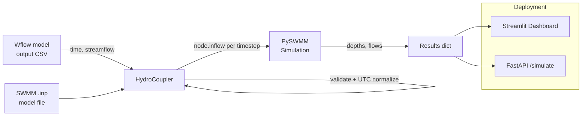

# Architecture

## High-level flow

## Data flow (step-by-step)

1. **Input** — the user provides a SWMM `.inp` file and a Wflow output CSV
   (with `time` and `streamflow` columns).
2. **Validation** — `HydroCoupler` validates both files, interpolates
   missing streamflow values, clips negative flows to zero, and converts
   all timestamps to UTC.
3. **Coupling** — the coupler loads the SWMM model via PySWMM's
   `Simulation()` context manager.
4. **Injection** — at each timestep, the coupler looks up (or finds the
   nearest) Wflow flow value for the current simulation time and injects
   it into the target SWMM node with `node.inflow(value)`.
5. **Extraction** — after the run, node depths and a flooding summary are
   collected; `model_runner.extract_binary_results` can additionally pull
   detailed series from SWMM's binary `.out` file.
6. **Visualization** — results are rendered as hydrographs and summary
   statistics in the Streamlit dashboard, or returned as JSON from the
   FastAPI `/simulate` endpoint.

## Technology stack

| Component | Technology | Purpose |
|---|---|---|
| Core coupling | Python 3.10+ | Main programming language |
| SWMM interface | PySWMM 1.3.0+ | Python wrapper for the EPA SWMM5 API |
| Model editing (optional) | swmmx | Unified toolkit for building/editing SWMM models |
| Dashboard | Streamlit | Interactive web interface |
| API | FastAPI | RESTful API for model execution |
| Containerization | Docker + docker-compose | Reproducible environment |
| CI/CD | GitHub Actions | Automated testing and deployment |
| Visualization | Plotly, Folium, Matplotlib | Charts and maps |
| Data handling | Pandas, xarray, NetCDF4 | Time-series and geospatial data |

## Why timezone handling gets special treatment

A one-hour offset between a Wflow output and a SWMM simulation clock can
shift when peak inflow arrives relative to a storm event, which changes
predicted flood timing and magnitude. `HydroCoupler._load_wflow_flow`
therefore always normalizes to UTC with `pd.to_datetime(..., utc=True)`,
and `utils.validate_timezone` is available for normalizing any other
time-indexed DataFrame the same way.
